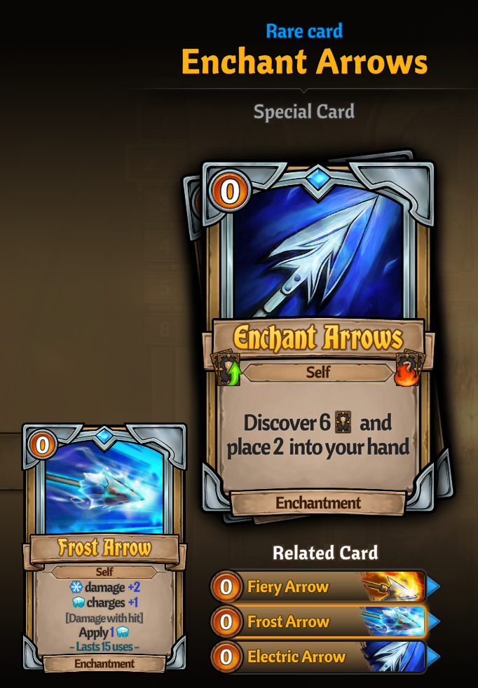
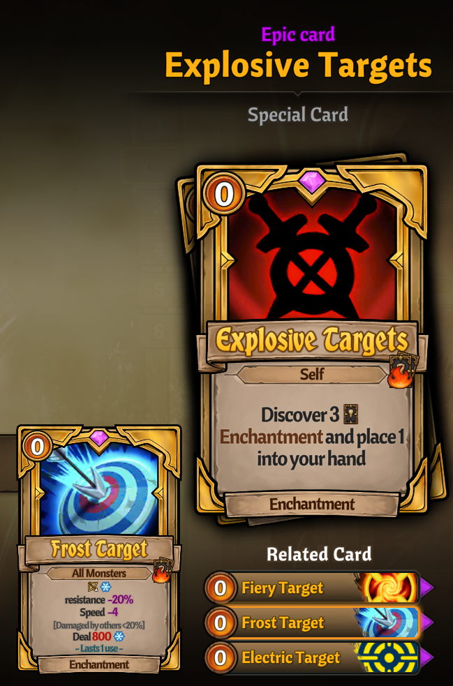
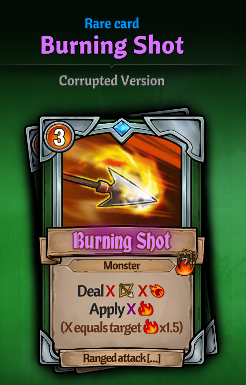
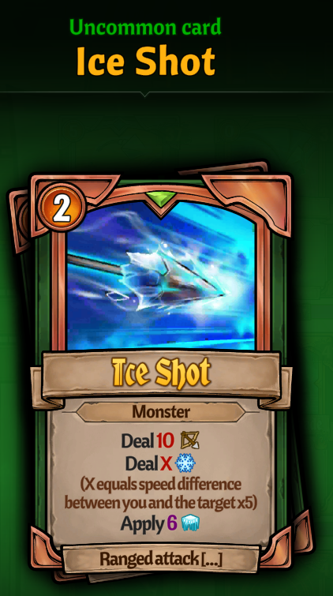
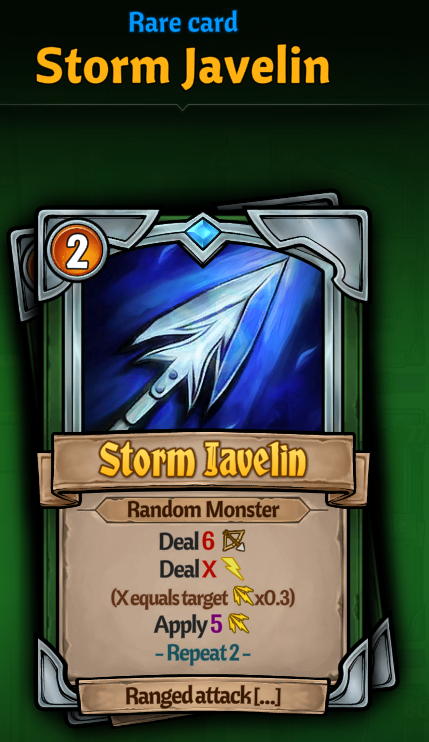
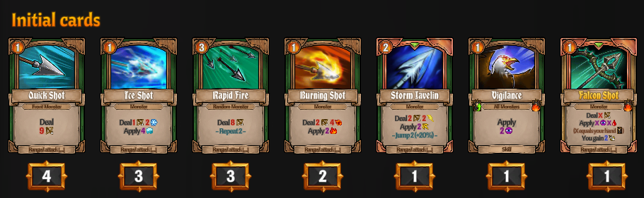

# Magic Archer Sylvie

A content pack for [Obeliskial Content](https://across-the-obelisk.thunderstore.io/package/meds/Obeliskial_Content/) that redo 2 Sylvie's enchantments, traits, ranged attack cards and Sylvie's initial cards

Enchantments

### Enchantments

PS: the Frost target's real effect is "reduce 20% pierce resistance and 35% cold resistance"

Cards

### Cards

Initial Cards

I'll be modifying this data frequently to make balance. So the picture maybe isn't the true number. You can check them out at the Town of Knowledge in game.

## Installation (manual)

1. Install [Obeliskial Essentials](https://across-the-obelisk.thunderstore.io/package/meds/Obeliskial_Essentials/) and [Obeliskial Content](https://across-the-obelisk.thunderstore.io/package/meds/Obeliskial_Content/).
2. Click _Manual Download_ at the top of the page.
3. In Steam, right-click Across the Obelisk and select _Manage_->_Browse local files_.
4. Extract the archive into the game folder. Your _Across the Obelisk_ folder should now contain a _BepInEx_ folder and a _doorstop\_libs_ folder.
5. Run the game. If everything runs correctly, you will see this mod in the list of registered mods on the main menu.
6. Press F5 to open/close the Config Manager and F1 to show/hide mod version information.

## Installation (automatic)

1. Download and install [Thunderstore Mod Manager](https://www.overwolf.com/app/Thunderstore-Thunderstore_Mod_Manager) or [r2modman](https://across-the-obelisk.thunderstore.io/package/ebkr/r2modman/).
2. Click **Install with Mod Manager** button on top of the page.
3. Run the game via the mod manager.

## Support

I will keep watching for cards strength, try to make sure these cards display their strength that should be there. Create a real magic archer instead of only using sharp to deal damage.

Unfortunately, I can't redo all traits' effect now. So it's not all the effects I am expecting. I'll realise them in future.

Hope you enjoy it and if have any idea or bug, just open a github issue or make a post in the **modding #support-and-requests** channel of the [official Across the Obelisk Discord](https://discord.gg/across-the-obelisk-679706811108163701).